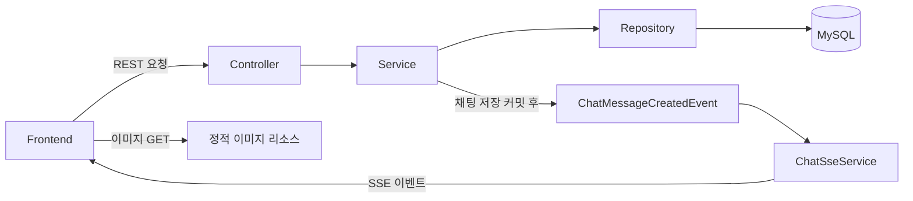

# ARETEUM | 동덕여자대학교 대동제 Backend

2026 동덕여자대학교 대동제의 부스·공연 정보와 익명 채팅 '솜톡'을 제공하는 백엔드입니다.
축제 참여자가 날짜별 행사 정보를 확인하고, 채팅으로 소식을 나눌 수 있도록 REST API와 SSE 스트림을 제공합니다.

- 행사 기간: 2026년 9월 29일 ~ 9월 30일
- [백엔드 저장소](https://github.com/DW26ARETEUM/DW26ARETEUM_BE)
- [배포 Swagger](https://dwu-festival2026.13-124-181-178.sslip.io/swagger-ui/index.html)
- API Base URL: `https://dwu-festival2026.13-124-181-178.sslip.io`

## 📌 주요 기능

### 부스 목록·검색

- 선택한 날짜에 운영하는 부스를 조회합니다.
- 분류, 부스명·운영 주체 검색어, 부스 ID 목록을 함께 적용할 수 있습니다.
- 검색은 대소문자를 구분하지 않는 부분 일치 방식이며, 검색어는 앞뒤 공백 제거 후 최대 50자까지 허용합니다.
- 찜한 부스는 프론트가 전달한 `ids`로 필터링합니다. 서버에 사용자별 찜을 저장하는 API는 없으며, 찜 조회에도 선택 날짜 조건이 적용됩니다.
- 분류 → 지도 번호 순으로 반환하고, 목록 항목에 실제 운영 날짜인 `operationDate`를 포함합니다.
- 운영 정보 조회에 `join fetch`를 사용하여 연결된 부스 정보도 함께 가져옵니다.

### 부스 상세·메뉴·이미지

- 기본정보, 소개, 전체 운영 일정, 메뉴·상품을 한 번의 상세 요청으로 제공합니다.
- 부스 기본정보·운영 일정·메뉴는 각각 조회하여 응답 DTO로 조합합니다.
- 날짜에 따라 달라지는 시간, 지도 번호, 위치 이미지를 운영 일정별로 관리합니다.
- 솜컬렉션 상품, 주점 메뉴, 푸드트럭 메뉴를 표시 순서대로 제공합니다.
- 가격은 `3000₩`, `8000₩~`, `4000~5000₩`처럼 표시용 문자열로 전달합니다.
- 위치 이미지와 주점 아이콘은 서버 정적 리소스로 제공하며, 고해상도 이미지 교체 및 소개 문구 줄바꿈을 반영했습니다.

| 분류 | 코드 |
| --- | --- |
| 일반부스 | `GENERAL` |
| 솜컬렉션 | `SOM_COLLECTION` |
| 축제운영위원회 | `COMMITTEE` |
| 푸드트럭 | `FOOD_TRUCK` |
| 주점 | `PUB` |

### 공연 일정·관리

- 날짜별 또는 전체 공연 목록과 개별 공연 상세 정보를 조회합니다.
- 전체 목록은 날짜·시작 시간순, 날짜별 목록은 시작 시간순으로 반환합니다.
- 공연명, 영문 공연명, 출연자, 날짜, 시간, 장소, 공연 분류를 제공합니다.
- `X-Admin-Key` 헤더를 확인하여 공연 수정·삭제 접근을 제한합니다. 조회에는 관리자 키가 필요하지 않습니다.
- 수정은 전체 필드를 전달하는 `PUT` 방식이며, 필수값·문자열 길이·종료 시간이 시작 시간보다 늦은지 검증합니다.
- 공연 이미지는 프론트에서 공연 ID를 기준으로 연결하는 구조입니다.

| 분류 | 코드 |
| --- | --- |
| 동아리 공연 | `CLUB` |
| 일반 공연 | `GENERAL` |
| 스페셜 스테이지 | `SPECIAL` |
| 아티스트 | `ARTIST` |

### 솜톡 채팅

- `X-Client-Id` 헤더의 UUID v4를 익명 클라이언트 식별자로 사용합니다.
- 메시지 내용과 `CHAT` 또는 `INFO` 카테고리를 저장합니다.
- 메시지는 공백만으로 작성할 수 없으며 최대 53자입니다.
- 최근 메시지, 특정 ID 이전·이후 메시지, 본문 검색 및 카테고리 필터를 지원합니다.
- 조회 개수는 기본 50개, 최대 100개입니다.
- 최근·이전·이후 조회 결과는 메시지 ID 오름차순, 검색 결과는 내림차순으로 반환합니다.

### 새 메시지 실시간 전송

- `SseEmitter`로 클라이언트의 SSE 연결을 유지합니다.
- 메시지 저장 트랜잭션이 커밋된 뒤 `chat-message-created` 이벤트를 발행합니다.
- 이벤트 ID는 메시지 ID이며, 데이터는 `ChatMessageResponse`입니다.
- 연결 완료·시간 초과·오류 발생 시 연결 목록에서 제거합니다. 연결 제한 시간은 1시간입니다.
- 현재 연결은 서버 메모리에서 관리하고 모든 구독자에게 전달합니다. SSE 구독 단계의 카테고리 필터나 과거 이벤트 자동 재전송은 구현되어 있지 않습니다.
- 재접속 시 누락 메시지는 REST의 `after` 조회로 보완할 수 있으며, 클라이언트는 `messageId`를 기준으로 중복을 처리해야 합니다.

## 📌 기술 스택

### Backend

<p>
  
  
  
  
  
  
  
</p>

### Infra / Collaboration

<p>
  
  
  
  
  
</p>

### 버전 정보

| 항목 | 버전 |
| --- | --- |
| Java | 21 |
| Spring Boot | 4.1.1 |
| Gradle Wrapper | 9.7.1 |
| springdoc-openapi | 3.0.3 |

## 📌 구성과 데이터 흐름



### 주요 테이블

| 테이블 | 역할 |
| --- | --- |
| `booth` | 부스 기본정보, 소개, 아이콘 경로 |
| `booth_operation` | 부스별 운영 날짜·시간·지도 번호·위치 이미지 경로 |
| `booth_menu` | 부스별 메뉴·상품·설명·가격·표시 순서 |
| `performance` | 공연 정보 및 일정 |
| `chat_message` | 익명 클라이언트 ID, 메시지, 카테고리, 작성 시각 |

`booth_operation`과 `booth_menu`는 각각 `booth`를 참조합니다. 공연과 채팅은 별도 테이블로 관리합니다.

## 📌 API 안내

| 도메인 | Method | Path | 기능 |
| --- | --- | --- | --- |
| 부스 | GET | `/api/v1/booths` | 날짜별 목록·검색·찜 ID 필터 |
| 부스 | GET | `/api/v1/booths/{boothId}` | 상세·전체 운영 일정·메뉴 |
| 공연 | GET | `/api/v1/performances` | 전체 또는 날짜별 목록 |
| 공연 | GET | `/api/v1/performances/{performanceId}` | 상세 조회 |
| 공연 | PUT | `/api/v1/performances/{performanceId}` | 관리자 수정 |
| 공연 | DELETE | `/api/v1/performances/{performanceId}` | 관리자 삭제 |
| 채팅 | POST | `/api/v1/chat/messages` | 메시지 저장, 성공 시 201 |
| 채팅 | GET | `/api/v1/chat/messages` | 최근·이전·이후 조회 및 검색 |
| SSE | GET | `/api/v1/chat/stream` | 새 채팅 메시지 구독 |

### 주요 요청 규칙

| API | 요청 규칙 |
| --- | --- |
| 부스 목록 | `date` 필수. `category`, `keyword`, 쉼표 구분 `ids` 선택. `ids` 최대 100개 |
| 공연 목록 | `date` 선택. 생략하면 전체 일정 조회 |
| 공연 수정·삭제 | `X-Admin-Key` 필수 |
| 채팅 저장 | UUID v4 형식의 `X-Client-Id`, 본문 `content`·`category` 필수 |
| 채팅 조회 | `keyword`, `before`, `after`, `category` 선택. `limit`은 1~100 |
| 채팅 조회 제한 | `before`와 `after` 동시 사용 불가. `keyword`와 커서 동시 사용 불가. 빈 검색어 불가 |

### 공통 REST 응답

```json
{
  "success": true,
  "code": "SUCCESS",
  "message": "요청에 성공했습니다.",
  "data": {}
}
```

`data`는 API에 따라 객체·배열·null입니다. 정의된 오류 응답에서는 `success`가 false이고 `data`는 null입니다. SSE는 이 포맷으로 감싸지 않는 `text/event-stream` 응답입니다.

| 주요 오류 코드 | HTTP 상태 | 의미 |
| --- | --- | --- |
| `COMMON_INVALID_REQUEST` | 400 | 요청값·형식 검증 실패 |
| `COMMON_FORBIDDEN` | 403 | 공연 관리자 키 누락·불일치 |
| `BOOTH_NOT_FOUND` | 404 | 존재하지 않는 부스 |
| `PERFORMANCE_NOT_FOUND` | 404 | 존재하지 않는 공연 |

## 📌 프로젝트 구조

```text
src/
├── main/
│   ├── java/com/dongduk/daedongje/
│   │   ├── booth/          # 목록·상세·운영 일정·메뉴
│   │   ├── performance/    # 공연 조회·수정·삭제·관리자 키 검사
│   │   ├── chat/           # 메시지 저장·조회·검색
│   │   ├── sse/            # 구독 연결·메시지 이벤트 전송
│   │   └── global/         # 공통 응답·예외 처리
│   └── resources/
│       ├── application.yaml
│       └── static/images/
│           ├── booth-locations/
│           └── booth-icons/
├── db/
│   ├── booth/
│   ├── performance/
│   └── chat/
└── test/
.github/
├── CONTRIBUTING.md
├── PULL_REQUEST_TEMPLATE.md
└── ISSUE_TEMPLATE/
```

## 📌 팀원 및 역할

| 이름 | GitHub | 담당 기능 |
| --- | --- | --- |
| 이윤진 | [ylly5](https://github.com/ylly5) | SSE 구독 및 실시간 메시지 전송 |
| 이지우 | [jiwoolee211](https://github.com/jiwoolee211) | 공연 조회·관리자 수정·삭제 |
| 임가영 | [lojhbm](https://github.com/lojhbm) | 채팅 저장·조회·검색, SSE 연계 |
| 장현지 | [hyunji726](https://github.com/hyunji726) | 부스 목록·검색·찜 필터, Swagger 설정 |
| 황세연 | [hiseyeon](https://github.com/hiseyeon) | 프로젝트 초기 설정, 부스 상세·메뉴·이미지 |
| 황윤하 | [unvya](https://github.com/unvya) | 공통 환경·서버 배포, DB 운영 및 프론트 연동 환경 관리 |

<div align="center">
<table>
  <tr>
    <td align="center" width="200">
      <a href="https://github.com/ylly5">
        
        <br/>
        <b>이윤진</b>
      </a>
      <br/>
      <sub>@ylly5</sub>
    </td>
    <td align="center" width="200">
      <a href="https://github.com/jiwoolee211">
        
        <br/>
        <b>이지우</b>
      </a>
      <br/>
      <sub>@jiwoolee211</sub>
    </td>
    <td align="center" width="200">
      <a href="https://github.com/lojhbm">
        
        <br/>
        <b>임가영</b>
      </a>
      <br/>
      <sub>@lojhbm</sub>
    </td>
  </tr>
  <tr>
    <td align="center" width="200">
      <a href="https://github.com/hyunji726">
        
        <br/>
        <b>장현지</b>
      </a>
      <br/>
      <sub>@hyunji726</sub>
    </td>
    <td align="center" width="200">
      <a href="https://github.com/hiseyeon">
        
        <br/>
        <b>황세연</b>
      </a>
      <br/>
      <sub>@hiseyeon</sub>
    </td>
    <td align="center" width="200">
      <a href="https://github.com/unvya">
        
        <br/>
        <b>황윤하</b>
      </a>
      <br/>
      <sub>@unvya</sub>
    </td>
  </tr>
</table>
</div>

## 📌 협업 규칙

- 최신 `dev`에서 `작업유형/이슈번호-작업내용` 브랜치를 생성합니다.
- 일반 작업은 `작업 브랜치 → dev`, 배포는 `dev → main` PR로 진행합니다.
- 작성자 외 최소 1명의 리뷰 승인을 받고, 미해결 대화와 검증 결과를 확인합니다.
- 작업 PR은 Squash and merge, 배포 PR은 Create a merge commit을 사용합니다.
- 커밋 형식: `유형: 작업 내용 (#이슈번호)`
- API·DB·환경 변수 변경 및 적용 절차는 PR에 기록하고 담당자에게 공유합니다.

상세 규칙은 [.github/CONTRIBUTING.md](.github/CONTRIBUTING.md)를 참고합니다.
